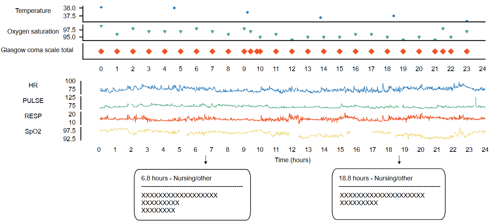
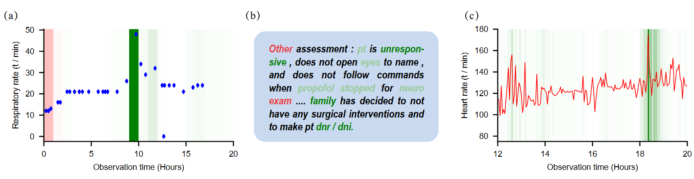

# XAI-ICU

## XAI for In-Hospital Mortality Prediction via Multimodal ICU Data

**XAI-ICU** is an explainable multimodal learning framework for in-hospital mortality prediction using heterogeneous ICU data.

The project integrates three types of clinical information:

- structured clinical event sequences,
- high-density vital signs / waveform-derived measurements,
- clinical notes.

We develop an **eXplainable Multimodal Mortality Predictor (X-MMP)** for multimodal representation learning and introduce **LRPTrans**, an extension of Layer-Wise Relevance Propagation (LRP) to Transformer architectures, for interpreting predictions across heterogeneous clinical modalities.

**Paper:**  
Xingqiao Li et al., *XAI for In-Hospital Mortality Prediction via Multimodal ICU Data*, IEEE BIBM 2025.

[Preprint: arXiv:2312.17624](https://arxiv.org/abs/2312.17624)

---

## Framework

<p align="center">
  
</p>

X-MMP uses modality-specific Transformer-based encoders to learn representations from heterogeneous ICU data.

The learned representations from different modalities are integrated through **late fusion** for in-hospital mortality prediction.

To interpret model decisions, **LRPTrans** propagates attribution through the Transformer architecture and estimates the contribution of input features from different clinical modalities to the final prediction.

---

## Multimodal ICU Data

The multimodal dataset is constructed based on:

- **MIMIC-III**
- **MIMIC-III Waveform Database Matched Subset**

Three complementary modalities are used.

### Discrete Clinical Events

Structured and time-stamped clinical observations recorded during the ICU stay.

### Vital Signs

High-density physiological signals and bedside-monitoring measurements.

### Clinical Notes

Unstructured clinical text describing patient status and clinical observations.

<p align="center">
  
</p>

The three modalities provide complementary information from structured clinical records, physiological monitoring, and free-text documentation.

---

## Main Results

### Multimodal Mortality Prediction

We compare single-modal, bi-modal, and tri-modal configurations to evaluate the contribution of heterogeneous clinical information.

| Input Modality | AUC-ROC | AUC-PR |
|---|---:|---:|
| Best single-modal model | 0.842 | 0.430 |
| Vital Signs + Clinical Notes | 0.821 | 0.351 |
| Vital Signs + Discrete Events | 0.849 | 0.429 |
| Clinical Notes + Discrete Events | 0.851 | 0.406 |
| **All three modalities (X-MMP)** | **0.858** | **0.430** |

The tri-modal model achieves the highest AUC-ROC:

- **X-MMP: 0.858**
- Best single-modal model: **0.842**
- Best bi-modal model: **0.851**

These results demonstrate that the three ICU modalities provide complementary information for mortality prediction.

---

## Explainability Evaluation

To quantitatively evaluate explanation quality, we conduct input perturbation experiments and compare LRPTrans with representative attribution approaches.

The evaluated methods include:

- Random attribution
- Last-layer Attention
- Attention Rollout
- Integrated Gradients
- LRP
- **LRPTrans**

| Modality | Random | Attention Rollout | Attention Last | IG | LRP | **LRPTrans** |
|---|---:|---:|---:|---:|---:|---:|
| Discrete Clinical Events | 0.745 | 0.772 | 0.770 | 0.774 | 0.767 | **0.777** |
| Clinical Notes | 0.705 | 0.712 | 0.731 | **0.755** | 0.744 | **0.755** |
| Vital Signs | 0.693 | 0.697 | 0.696 | 0.703 | **0.708** | **0.708** |

Values correspond to **AU-AUC-ROC** in the perturbation study.

LRPTrans achieves the best or tied-best interpretation performance across all three modalities.

---

## Explainability Example

LRPTrans can attribute model predictions back to individual clinical features.

The following example illustrates feature-level attribution for structured clinical event sequences.

<p align="center">
  
</p>

The attribution analysis identifies clinically meaningful structured variables associated with mortality prediction.

In the study, features related to the **Glasgow Coma Scale (GCS)** are among the important factors identified by the model. Lower GCS measurements, which indicate impaired consciousness and more severe patient status, show stronger positive contributions to mortality predictions.

This analysis demonstrates how X-MMP can provide interpretable evidence for individual model decisions rather than only producing a mortality probability.

---

## Repository Structure

```text
XAI-ICU/
├── config/
├── exp_explain_multimodal/
├── exp_model_performance/
├── exp_multi_modal/
├── mimic3benchmark/
├── model/
├── utils/
│
├── figure/
│   ├── framework.png
│   ├── multimodal_data_overview.png
│   └── explainability_case_events.png
│
├── LICENSE
└── README.md
```

The repository contains implementations for:

- single-modality prediction experiments;
- multimodal fusion experiments;
- Transformer-based mortality prediction;
- LRPTrans attribution;
- perturbation-based explanation evaluation;
- multimodal ICU data preprocessing.

---

## Data Availability

This project uses **MIMIC-III** and the **MIMIC-III Waveform Database Matched Subset**.

Due to the access requirements of the MIMIC datasets, the original patient data are **not distributed in this repository**.

Users should obtain authorized access to the corresponding PhysioNet datasets before running the preprocessing and experimental pipelines.

---

## Research Topics

- Multimodal Learning
- Transformer
- Explainable Artificial Intelligence
- Clinical AI
- Clinical Time-Series Modeling
- Clinical NLP
- Feature Attribution
- ICU Outcome Prediction

---

## Publication

**Xingqiao Li, Jindong Gu, Zhiyong Wang, Yancheng Yuan, Bo Du, and Fengxiang He**

*XAI for In-Hospital Mortality Prediction via Multimodal ICU Data*

**IEEE BIBM 2025**

Preprint:  
[https://arxiv.org/abs/2312.17624](https://arxiv.org/abs/2312.17624)

---

## Citation

If you find this work useful, please cite:

```bibtex
@inproceedings{li2025xai,
  title={XAI for in-hospital mortality prediction via multimodal ICU data},
  author={Li, Xingqiao and Gu, Jindong and Wang, Zhiyong and Yuan, Yancheng and He, Fengxiang and Du, Bo},
  booktitle={2025 IEEE International Conference on Bioinformatics and Biomedicine (BIBM)},
  pages={3798--3801},
  year={2025},
  organization={IEEE}
}
```

The citation information will be updated with the final IEEE BIBM bibliographic record when available.

---

## License

This project is released under the **MIT License**.

See [LICENSE](LICENSE) for details.

---

## Contact

**Xingqiao Li**  
School of Computer Science, Wuhan University

GitHub: [lixingqiao](https://github.com/lixingqiao)
