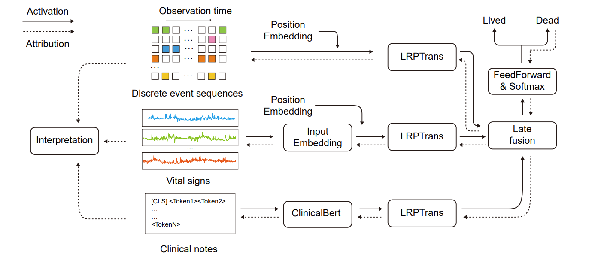

# XAI-ICU

## XAI for In-Hospital Mortality Prediction via Multimodal ICU Data

**XAI-ICU** is an explainable multimodal learning framework for in-hospital mortality prediction using heterogeneous ICU data.

The project integrates three types of clinical information:

- structured clinical event sequences,
- high-density vital signs / waveform-derived measurements,
- clinical notes.

We develop an **eXplainable Multimodal Mortality Predictor (X-MMP)** for multimodal representation learning and introduce **LRPTrans**, an extension of Layer-Wise Relevance Propagation (LRP) to Transformer architectures, for interpreting predictions across heterogeneous clinical modalities.

Paper:

**Xingqiao Li et al.**  
*XAI for In-Hospital Mortality Prediction via Multimodal ICU Data*

IEEE BIBM 2025

Preprint: [arXiv:2312.17624](https://arxiv.org/abs/2312.17624)

---

## Framework

<p align="center">
  
</p>

X-MMP contains modality-specific Transformer encoders for heterogeneous ICU inputs.

The learned representations from different modalities are integrated through **late fusion** for in-hospital mortality prediction.

LRPTrans propagates attribution through Transformer-based encoders to estimate the contribution of individual input features and different modalities to the final prediction.

---

## Multimodal ICU Data

The multimodal dataset is constructed using:

- **MIMIC-III**
- **MIMIC-III Waveform Database Matched Subset**

Three modalities are considered.

### Discrete Clinical Events

Structured and time-stamped clinical measurements collected during the ICU stay.

### Vital Signs

High-density physiological signals and bedside-monitoring measurements.

### Clinical Notes

Unstructured clinical text modeled with representations derived from **ClinicalBERT**.

---

## Main Results

### Mortality Prediction

The tri-modal X-MMP model achieves the best predictive performance among the evaluated single-modal and multimodal configurations.

| Input Modality | AUC-ROC | AUC-PR |
|---|---:|---:|
| Best single-modal model | 0.842 | 0.430 |
| Vital Signs + Clinical Notes | 0.821 | 0.351 |
| Vital Signs + Discrete Events | 0.849 | 0.429 |
| Clinical Notes + Discrete Events | 0.851 | 0.406 |
| **All three modalities (X-MMP)** | **0.858** | **0.430** |

The tri-modal model achieves:

- **AUC-ROC = 0.858**
- higher AUC-ROC than the best single-modal model (**0.842**)
- higher AUC-ROC than the best bi-modal model (**0.851**)

These results demonstrate the complementary information provided by heterogeneous clinical modalities.

---

## Explainability Results

To quantitatively evaluate explanation quality, we conduct input perturbation experiments.

Input features are progressively removed according to their attribution scores, and the resulting change in predictive performance is measured.

The evaluation compares:

- Random attribution
- Last-layer Attention
- Attention Rollout
- Integrated Gradients (IG)
- LRP
- **LRPTrans**

### Perturbation Results

| Modality | Random | Attention Rollout | Attention Last | IG | LRP | **LRPTrans** |
|---|---:|---:|---:|---:|---:|---:|
| Discrete Clinical Events | 0.745 | 0.772 | 0.770 | 0.774 | 0.767 | **0.777** |
| Clinical Notes | 0.705 | 0.712 | 0.731 | **0.755** | 0.744 | **0.755** |
| Vital Signs | 0.693 | 0.697 | 0.696 | 0.703 | **0.708** | **0.708** |

Values correspond to **AU-AUC-ROC** in the perturbation study.

LRPTrans achieves the best or tied-best interpretation performance across all three modalities.

---

## Interpretation of Multimodal Predictions

LRPTrans supports attribution analysis at both the feature and modality levels.

The analysis identifies clinically meaningful features associated with mortality risk, including:

- Glasgow Coma Scale (GCS) measurements from structured clinical events;
- clinically relevant terms such as `arrest`, `unresponsive`, and `dnr/dni` from clinical notes;
- abnormal physiological patterns such as heart-rate peaks and SpO2-related signals from vital-sign data.

The framework therefore supports both mortality prediction and analysis of the clinical evidence contributing to model decisions.

---

## Repository Structure

```text
XAI-ICU/
├── config/
│   ├── exp_explain/
│   ├── exp_model_performance/
│   └── exp_multi_modal/
│
├── exp_explain_multimodal/
│   ├── explain_multimodal.py
│   ├── explain_notes.py
│   ├── explain_time_series.py
│   ├── explain_vital_signs.py
│   └── xai_model.py
│
├── exp_model_performance/
│   ├── notes/
│   ├── physi/
│   └── vital/
│
├── exp_multi_modal/
│   ├── multi_modal_analysis.ipynb
│   ├── params_search.py
│   └── train_eval.py
│
├── mimic3benchmark/
│   ├── resources/
│   ├── scripts/
│   └── data preprocessing utilities
│
├── model/
│   ├── multi_modal_model.py
│   ├── xai_transformer.py
│   └── modality-specific models
│
├── utils/
│   └── preprocessing, dataset, metric, and attribution utilities
│
├── framework.png
├── LICENSE
└── README.md
```

---

## Experiments

The repository contains three major groups of experiments.

### 1. Single-Modality Modeling

Models are evaluated independently on:

- discrete clinical events,
- clinical notes,
- vital signs.

The experiments compare Transformer-based models with representative recurrent and convolutional baselines.

Relevant code:

```text
exp_model_performance/
```

---

### 2. Multimodal Modeling

Different combinations of ICU modalities are evaluated to analyze the complementarity of heterogeneous clinical information.

Relevant code:

```text
exp_multi_modal/
```

Example:

```bash
python exp_multi_modal/train_eval.py \
  -c config/exp_multi_modal/params_multi_modal.json \
  -d 0
```

The configuration file controls the selected modalities, model settings, training parameters, and local data paths.

---

### 3. Explainability Analysis

LRPTrans and other attribution methods are evaluated through perturbation experiments and multimodal attribution analysis.

Relevant code:

```text
exp_explain_multimodal/
```

Example:

```bash
python exp_explain_multimodal/explain_multimodal.py \
  -c config/exp_explain/params_explain.json \
  -d 0
```

---

## Data Preparation

The project uses **MIMIC-III** and the **MIMIC-III Waveform Database Matched Subset**.

Due to the access requirements of the MIMIC datasets, the original patient data are **not distributed in this repository**.

Utilities for extracting and preprocessing the required data are provided under:

```text
mimic3benchmark/
```

Users should first obtain authorized access to the corresponding PhysioNet datasets and then configure the local data paths before running the preprocessing and training pipelines.

---

## Research Topics

- Multimodal Learning
- Transformer
- Explainable Artificial Intelligence
- Clinical AI
- Time-Series Modeling
- Clinical NLP
- Feature Attribution
- ICU Outcome Prediction

---

## Publication

**Xingqiao Li, Jindong Gu, Zhiyong Wang, Yancheng Yuan, Bo Du, and Fengxiang He**

*XAI for In-Hospital Mortality Prediction via Multimodal ICU Data*

**IEEE BIBM 2025**

Preprint:

[https://arxiv.org/abs/2312.17624](https://arxiv.org/abs/2312.17624)

---

## Citation

If you find this work useful, please cite:

```bibtex
@article{li2023xai,
  title={XAI for In-Hospital Mortality Prediction via Multimodal ICU Data},
  author={Li, Xingqiao and Gu, Jindong and Wang, Zhiyong and Yuan, Yancheng and Du, Bo and He, Fengxiang},
  journal={arXiv preprint arXiv:2312.17624},
  year={2023}
}
```

The citation information can be updated to the final IEEE BIBM publication record when the official bibliographic information is available.

---

## License

This project is released under the **MIT License**.

See [LICENSE](LICENSE) for details.

---

## Contact

**Xingqiao Li**  
School of Computer Science, Wuhan University

GitHub: [lixingqiao](https://github.com/lixingqiao)
