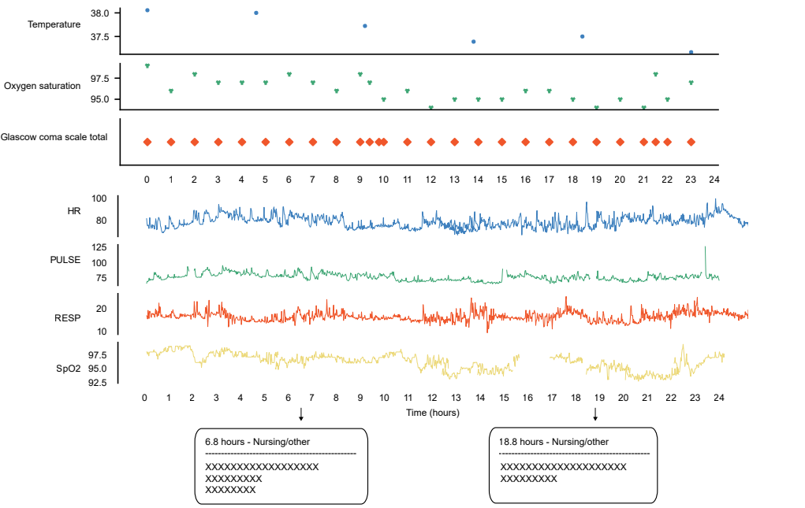

## MIMIC-III Multimodal Benchmarks Dataset

### Demo of multimodal dataset

<p align="center"></p>

### Preprocess steps

Here are the required steps to build the multi-modal benchmark. It assumes that you have download MIMIC-III dataset and MIMIC-III Waveform Match Subset on the disk. Creating the benchmark will follow the same instructions as the original MIMIC-III Benchmark, with several deviations.
    
1. The following command takes MIMIC-III CSVs, generates one directory per `SUBJECT_ID` and writes ICU stay information to `data/{SUBJECT_ID}/stays.csv`, diagnoses to `data/{SUBJECT_ID}/diagnoses.csv`, and events to `data/{SUBJECT_ID}/events.csv`. This step might take around an hour.

       python -m mimic3benchmark.scripts.extract_subjects {PATH TO MIMIC-III CSVs} data/root/

2. The following command attempts to fix some issues (ICU stay ID is missing) and removes the events that have missing information. About 80% of events remain after removing all suspicious rows.

       python -m mimic3benchmark.scripts.validate_events data/root/

3. The next command breaks up per-subject data into separate episodes (pertaining to ICU stays). Time series of events are stored in ```{SUBJECT_ID}/episode{#}_timeseries.csv``` (where # counts distinct episodes) while episode-level information (patient age, gender, ethnicity, height, weight) and outcomes (mortality, length of stay, diagnoses) are stores in ```{SUBJECT_ID}/episode{#}.csv```. This script requires two files, one that maps event ITEMIDs to clinical variables and another that defines valid ranges for clinical variables (for detecting outliers, etc.). **Outlier detection is disabled in the current version**.

       python -m mimic3benchmark.scripts.extract_episodes_from_subjects data/root/

4. The next command extract notes from clinical notes. Notes for each icu stay episode are stored in  ```{SUBJECT_ID}/notes{#}_timeseries.csv```. 

       python mimic3benchmark/scripts/extract_notes_from_subjects.py --mimic3_path {PATH TO MIMIC-III CSVs} --data_path data/root/

5. The next command extract vital signals from MIMIC-III Waveform Database Matched Subset. Vital signs for each icu stay episode are stored in  ```{SUBJECT_ID}/vital{#}_timeseries.csv```. 

       python mimic3benchmark/scripts/extract_vital_sign_from_subjects.py --mimic3_path {PATH TO MIMIC-III Waveform Matched Subset RECORDS-numerics} --data_path data/root/

6. The following commands will generate multi-modal datasets.

       python mimic3benchmark/scripts/create_multimodal.py --data_path data/root --out_path {PATH TO SAVE DATASET}

After the above commands are done, there will be a directory `dataset/` containing `dataset.csv` to indicate the meta information for multimodal datasets.


### Train / validation split

Use the following command to extract validation set from the training set. This step is required for running the baseline models. Likewise the train/test split, the train/validation split is the same for all tasks.

       python mimic3benchmark/scripts/split_datasets.py --data_path {dataset-directory}

After running, this script will generate `multimodal.csv`, `notes_no_align.csv` and `physi_no_align.csv` in `{dataset-directory}`.
